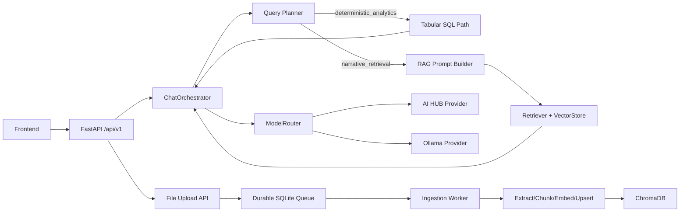

# 00. System Overview

## Scope
`llama-service` is an offline-first backend for file-aware chat and tabular analytics.

Constraints:
- No internet dependency in production contour.
- `AI HUB` is primary LLM runtime.
- `Ollama` is emergency fallback only (policy-gated).

## Runtime Entry Points
- API app: `app/main.py`.
- HTTP API v1 router: `app/api/v1/router.py`.
- Ingestion worker runtime bootstrap: `app/services/file.py` (`_ensure_worker_started`, startup recovery via FastAPI lifespan).

## Subsystems
- API/auth/session: `app/api`, `app/core`, `app/db`, `app/crud`, `app/schemas`.
- Chat orchestration: `app/services/chat_orchestrator.py`, `app/services/chat/*`.
- LLM routing/providers: `app/services/llm/*`.
- RAG/retrieval/vector: `app/rag/*`.
- Deterministic tabular analytics: `app/services/tabular/*`, `app/services/chat/tabular_sql.py`.
- Durable ingestion: `app/services/ingestion/*`, `app/services/file.py`.
- Observability/SLO: `app/observability/*`.
- Eval framework: `scripts/evals/*`, datasets in `tests/evals/datasets/*`.

## High-Level Architecture

## Primary Data Stores
- OLTP metadata: SQLAlchemy DB (`DATABASE_URL`).
- Vector index: Chroma persistent client (`VECTORDB_PATH`).
- Tabular runtime: DuckDB catalog + Parquet datasets (`TABULAR_RUNTIME_*`).
- Ingestion queue: SQLite queue file (`INGESTION_QUEUE_SQLITE_PATH`).

## Current Architecture Status
- Circular dependencies in `app/*` import graph: not detected.
- Main coupling hotspots: `app/services/file.py`, `app/services/chat_orchestrator.py`, `app/services/chat/rag_prompt_builder.py`.
- Candidate dead code: `app/core/exceptions.py`, `app/observability/logging.py` (no in-repo imports).
