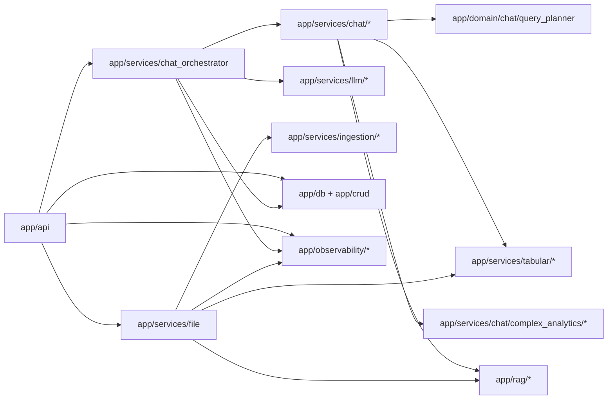
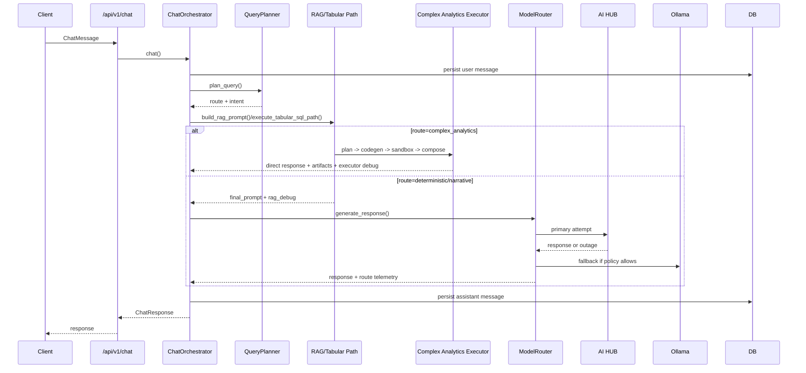

# 01. Architecture Overview

## Architectural Style
Service-oriented monolith with explicit subsystem boundaries:
- API layer (`app/api`).
- Domain/planning logic (`app/domain`).
- Application services (`app/services`).
- Infra adapters (`app/rag`, `app/services/llm/providers`, `app/services/ingestion`, `app/services/tabular`).

## Dependency Graph Summary (Repository Scan)
Scan date: `2026-03-05`.

- Python modules in `app/`: `101`.
- Internal import edges: `221`.
- Circular dependencies: `0` detected.

## Dependency Graph (Logical)

### Core modules (high fan-in)
- `app/core/config.py`
- `app/observability/metrics.py`
- `app/db/session.py`
- `app/db/models/*`

### Service modules (high fan-out)
- `app/services/file.py`
- `app/services/chat_orchestrator.py`
- `app/services/chat/rag_prompt_builder.py`
- `app/services/llm/manager.py`

### Cross-module coupling
- Chat orchestration depends on planner, RAG assembly, LLM routing, CRUD, and post-processing.
- Ingestion service couples queue runtime + document parsing + embeddings + vector store + tabular dataset generation.
- Tabular SQL path couples planner intent semantics with runtime guardrails and execution limits.

## Dead/Unused Candidates
No static circular deps, but probable unused modules:
- `app/core/exceptions.py`
- `app/observability/logging.py`

Validation method: no import references found via `rg` across `app/` and `tests/`.

## Risks
- `chat_orchestrator` and `file.py` remain orchestration-heavy (high change surface).
- Routing policy and deterministic SQL safety are spread across multiple modules and require contract-level tests to stay safe.

## Chat Lifecycle

## Architectural Fit vs Baseline (`docs/11`)
Implemented and aligned:
- AI HUB-first routing with policy-gated Ollama fallback.
- Durable ingestion queue.
- Deterministic tabular path with guardrails.
- Planner split deterministic vs narrative.
- Complex analytics sandbox path with direct short-circuit response, artifacts, and language-aware report formatting.
- Coverage/SLO instrumentation.
- Eval framework + CI gates.

Not fully aligned with target clean boundaries:
- Domain/use-case/adapters separation is partial, not strict.
- Several orchestration modules still combine policy and integration details.

## Update 2026-03-06
- Complex analytics execution plane is now explicit and deterministic in sequence:
  - planning prompt generation,
  - Python code generation,
  - secure sandbox execution,
  - final response composition.
- For broad analytics prompts with required charts, codegen now applies safe auto-repair when generated code misses visualization contract (`save_plot(...)`) before template fallback.
- Compose stage now has a quality gate: weak/non-informative LLM report text falls back to local structured formatter built from executed metrics/artifacts.
- Internal architecture for this route is modularized into:
  - `planner.py`, `codegen.py`, `sandbox.py`, `executor.py`, `composer.py`, `artifacts.py`, `errors.py`, `telemetry.py`,
  - `dataset_context.py`, `template_codegen.py`, `report_quality.py`, `localization.py`, `auto_visual_patch.py`, `executor_support.py`.
- Public import contract remains stable via `app.services.chat.complex_analytics`:
  - `execute_complex_analytics_path`
  - `is_complex_analytics_query`
- Debug contract includes non-breaking execution details for this repair path:
  - `complex_analytics.codegen_auto_visual_patch_applied`
  - `complex_analytics.complex_analytics_codegen.auto_visual_patch_applied`
  - `complex_analytics.response_status=fallback`
  - `complex_analytics.response_error_code=broad_query_local_formatter` for broad full-analysis prompts handled by deterministic local formatter.
- Next oversized-file split in chat plane:
  - `chat_orchestrator.py` extracted reusable helpers to `app/services/chat/orchestrator_helpers.py`,
  - `rag_prompt_builder.py` extracted route handlers to `app/services/chat/rag_prompt_routes.py`.
- Follow-up extraction:
  - stream/non-stream chat runtime moved to `app/services/chat/orchestrator_runtime.py`,
  - grouped retrieval/context helpers moved to `app/services/chat/rag_retrieval_helpers.py`.
- Narrative retrieval orchestration branch moved to `app/services/chat/rag_prompt_narrative.py`.
- Behavior and API contracts unchanged; extraction is internal-only.
