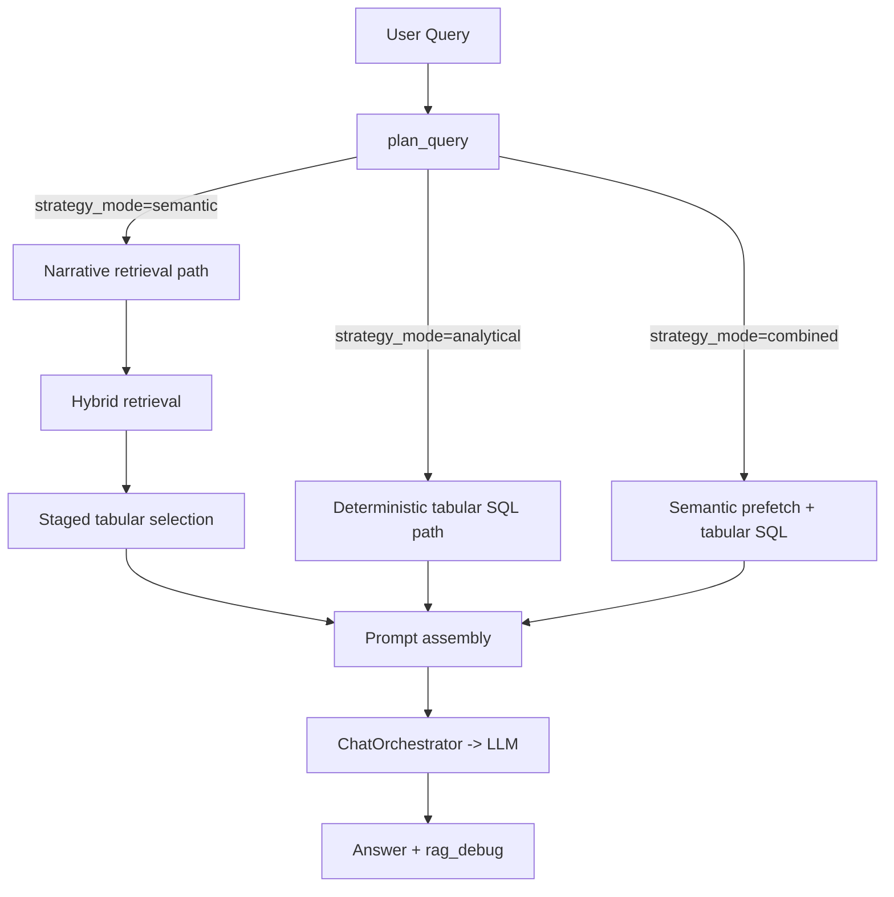

# 03. RAG Pipeline (Semantic + Analytical + Combined)

## Pipeline Map

## Route Modes
- `semantic`:
  - narrative/document lookup, "what is in file", "find relevant rows", "which sheet"
  - uses hybrid retrieval (`dense + lexical + rerank`)
- `analytical`:
  - deterministic aggregates/profile/lookup over tabular runtime
  - not embeddings-only
- `combined`:
  - semantic prefetch over tabular artifacts to select file/sheet scope
  - then deterministic SQL over selected scope

## Full-File Policy
- Full-file retrieval is explicit (`rag_mode=full_file`) or policy escalation.
- Removed legacy keyword-triggered full-file switch.

## Retrieval / Index Controls
- Active processing profile filtering:
  - retrieval gets `processing_ids` from active profile per file
  - files without active ready processing are excluded from retrieval path
- Embedding identity filtering:
  - `embedding_mode`, `embedding_model`
- Recommended defaults:
  - `RAG_DYNAMIC_TOPK_ENABLED=true`
  - `RAG_DYNAMIC_TOPK_MIN=8`
  - `RAG_DYNAMIC_TOPK_MAX=96`
  - `RAG_DYNAMIC_COVERAGE_MIN_RATIO=0.35`
  - `RAG_FULL_FILE_MAX_CHUNKS=800`
  - `RAG_FULL_FILE_MIN_ROW_COVERAGE=0.95`

## Context Assembly
- Semantic path:
  - staged tabular prioritization:
    - `file_summary`/`sheet_summary` first
    - then diverse `row_group`
    - dedup by chunk id/range
- Analytical path:
  - prompt built from deterministic SQL payload
- Combined path:
  - semantic evidence block + deterministic SQL payload in final prompt

## RAG Debug Contract
Key fields:
- `planner_decision.route`
- `planner_decision.strategy_mode` (`semantic|analytical|combined`)
- `retrieval_mode`
- `retrieval_path` (`vector|structured`)
- `applied_filters`
- `active_processing_ids`
- `retrieval_hits`
- `avg_similarity`
- `context_tokens`
- `rows_expected_total`
- `rows_retrieved_total`
- `row_coverage_ratio`
- `combined_scope` (for combined route)
- `analytical_mode_used`

## Legacy Removed
- keyword-based full-file hacks
- embeddings-only handling for deterministic tabular aggregates
- opaque route switching without debug visibility
- legacy SQLite tabular sidecar runtime (`sqlite_legacy`)
- compatibility `TypeError` fallbacks in retrieval contract (strict kwargs path)
- silent deterministic->narrative fallback on invalid deterministic payloads
- silent narrative retrieval failure fallback; now surfaced as explicit `narrative_error`

## Update 2026-03-26 (Deterministic Route Boundary Cleanup)

`app/services/chat/rag_prompt_routes.py` now delegates deterministic success-route
debug/result shaping to `app/services/chat/tabular_deterministic_result.py`.

Boundary intent:
- `rag_prompt_routes` remains route orchestration and branch selection.
- deterministic success debug/fallback/chart short-circuit shaping is centralized in a shared helper.
- route behavior and debug contract fields stay backward compatible.
