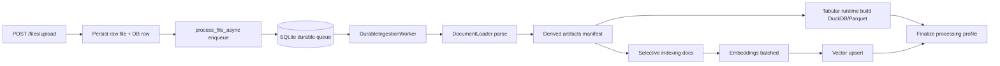

# 04. Ingestion Pipeline (Raw-File-First)

## End-to-End Flow

## Core Principle
- Raw file is the source of truth.
- Vector chunks are derived artifacts, not the only artifact.
- Artifacts are persisted under `runtime/file_artifacts/<file_id>/<processing_id>/manifest.json`.

## Derived Artifacts
### Narrative Files
- extracted text preview
- `document_summary` artifact
- split text chunks with metadata-rich vector docs

### CSV/TSV
- encoding detection
- delimiter detection
- header detection
- inferred column types
- preview rows
- `file_summary`, `sheet_summary`, `column_summary`, `row_group`
- schema snapshot in artifact manifest

### XLSX/XLS
- workbook summary
- per-sheet summary (rows/cols/types/preview)
- per-sheet row windows (`row_group`)
- optional column summaries
- workbook-level schema snapshot

## Selective Indexing Strategy
- Always index:
  - `file_summary`
  - `sheet_summary`
  - `column_summary` (bounded)
  - `row_group`
- For non-tabular files:
  - `document_summary`
  - split text chunks
- `TABULAR_MAX_EMBEDDING_DOCS` caps tabular explosion while preserving summary artifacts.

## Metadata Model (Vector Docs)
Every indexed artifact includes:
- `owner_user_id`
- `user_id`
- `file_id`
- `chat_id` (when available)
- `processing_id`
- `artifact_type`
- `chunk_type`
- `source_type`
- `sheet_name` (tabular)
- `chunk_index`
- `row_start` / `row_end` / `row_group_index` (tabular)
- `pipeline_version`
- `parser_version`
- `artifact_version`
- `embedding_mode`
- `embedding_model`
- `embedding_dimension`

## Processing / Safety
- Retrieval uses active processing profile ids per file.
- Files without active ready processing profile are excluded from RAG retrieval.
- Chat file list uses only `status=ready` files.
- Durable queue supports lease/heartbeat/retry/dead-letter/recovery.
- Finalization verifies counter consistency (`expected/processed/indexed/failed`).

## Observability
- Ingestion emits structured progress with:
  - stage/status
  - chunk type counters
  - embedding batches
  - vector upserts expected/actual
  - processing/profile versions
- Derived artifact persistence outcome is stored in processing metadata:
  - `derived_artifacts.manifest_path`
  - `derived_artifacts.artifact_counts`

## Removed Legacy Behavior
- No table ingestion through generic text splitter by default.
- No one-shot tabular text degradation as sole artifact.
- No hidden attachment-only file lifecycle.
- No legacy SQLite tabular sidecar execution/read fallback.
