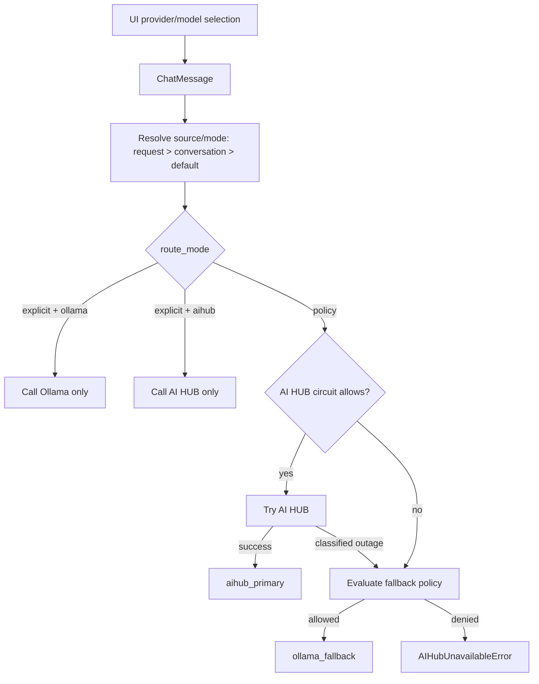

# 07. LLM Routing

## Scope
Routing is implemented in:
- `app/services/llm/routing/model_router.py`
- `app/services/llm/routing/policy.py`
- `app/services/llm/manager.py`
- `app/services/chat_orchestrator.py`

## Provider Modes
- `explicit`: use only the selected provider (`ollama`/`aihub`/`openai`), no cross-provider fallback.
- `policy`: AI HUB primary, Ollama fallback allowed only by fallback policy and outage classification.

## Precedence
Provider selection precedence:
1. UI request payload (`ChatMessage.model_source`, optional `provider_mode`)
2. Conversation state (`conversations.model_source`, `conversations.model_name`)
3. Server default (`DEFAULT_MODEL_SOURCE`)

Important behavior:
- UI `local`/`ollama` selection is treated as `explicit` route mode.
- In `explicit + ollama`, AI HUB is not called at all (no chat call, no pre-fallback attempt).
- `complex_analytics` execution route short-circuits generic chat generation in orchestrator and runs dedicated backend pipeline:
  - `plan` LLM call (strict JSON plan),
  - `codegen` LLM call (Python only),
  - sandbox execution,
  - final `compose` LLM call for user-facing report with quality gate and local formatter fallback.
- The route is implemented as modular package `app/services/chat/complex_analytics/` with separate planner/codegen/sandbox/executor/composer modules.
- Codegen/compose use the selected provider/model from request/conversation resolution; explicit local/provider selection has priority.
- `COMPLEX_ANALYTICS_CODEGEN_FORCE_LOCAL=true` can be used as an operational override, but is not the default behavior contract.
- Template fallback is enabled by default (`COMPLEX_ANALYTICS_ALLOW_TEMPLATE_FALLBACK=true`, `COMPLEX_ANALYTICS_ALLOW_TEMPLATE_RUNTIME_FALLBACK=true`) and remains confined to safe complex-analytics template execution path.
- For visualization-required plans, codegen stage attempts safe auto-repair when generated script omits `save_plot(...)`; this remains inside sandbox constraints.
- If plan/codegen fails or required visualization artifacts are missing, backend returns reason-specific clarification (no silent fallback to deterministic SQL path).
- In `complex_analytics` short-circuit responses, report language follows user query language (RU/EN).

## Parameter Flow Map
`UI selector -> /api/v1/chat payload -> ChatMessage schema -> ChatOrchestrator provider resolution -> LLMManager -> ModelRouter -> ProviderRegistry -> provider client`

Key fields:
- `model_source`: raw provider choice from UI/session (`local|ollama|aihub|corporate|openai`)
- `provider_mode`: optional (`explicit|policy`)
- `model_name`: selected model id
- policy controls: `cannot_wait`, `sla_tier`, `policy_class`

Source notes:
- UI payload: main source of truth when present.
- User profile/settings in backend DB: not implemented for provider selection (frontend keeps settings client-side).
- Conversation state: used when request does not provide provider/model.
- Server config defaults: fallback via `DEFAULT_MODEL_SOURCE`.

## Routing Decision Flow

## Fallback Policy (policy mode only)
Fallback is allowed only when all are true:
- outage reason in `{timeout, network, hub_5xx, circuit_open}`
- urgent request (`cannot_wait=true` or `sla_tier=critical`)
- `policy_class` is not restricted
- global fallback is enabled

## Route Telemetry Contract
Returned in chat response and SSE start/done/error payloads:
- `model_route`: `aihub_primary | ollama_fallback | aihub | ollama | openai`
- `route_mode`: `explicit | policy`
- `provider_selected`: raw selected provider (`local`, `aihub`, ...)
- `provider_effective`: actual provider used (`aihub|ollama|openai`)
- `fallback_attempted`: bool
- `fallback_reason`: `none | timeout | network | hub_5xx | circuit_open | null`
- `fallback_allowed`: bool
- `fallback_policy_version`: string
- `aihub_attempted`: bool

Additionally, chat request handling writes one structured log event:
- `chat_route_decision` with `route_mode`, `provider_selected`, `provider_effective`, `model_route`, `fallback_*`, `aihub_attempted`.

Execution-plane telemetry fields (non-breaking extension):
- `execution_route`: `tabular_sql | complex_analytics | narrative | clarification | unknown`
- `executor_attempted`: bool
- `executor_status`: `not_attempted | success | error | timeout | blocked | fallback`
- `executor_error_code`: nullable string
- `artifacts_count`: int
- `artifacts`: optional list for `complex_analytics` (`name`, relative `path`, `url`, `kind`, `content_type`); also emitted in SSE `done`
- `rag_debug.complex_analytics.code_source`: `llm | template | none`
- `rag_debug.complex_analytics.codegen`: codegen metadata (`codegen_status`, `codegen_error`, provider/mode/model)
- `rag_debug.complex_analytics.complex_analytics_code_generation_prompt_status`: `success | fallback | disabled`
- `rag_debug.complex_analytics.complex_analytics_code_generation_source`: `llm | template | none`
- `rag_debug.complex_analytics.complex_analytics_codegen.provider`: effective provider for codegen stage
- `rag_debug.complex_analytics.codegen_auto_visual_patch_applied`: bool
- `rag_debug.complex_analytics.complex_analytics_codegen.auto_visual_patch_applied`: bool
- `rag_debug.complex_analytics.response_status`: `success | fallback | error | not_attempted`
- `rag_debug.complex_analytics.response_error_code`: may include `low_content_quality` and `broad_query_local_formatter`
- `rag_debug.complex_analytics.sandbox.secure_eval`: sandbox execution guard flag

## Update 2026-03-06
- `complex_analytics` path uses backend two-pass code generation (`plan -> codegen`) and final response composition stage.
- Template fallback is default-on for safe complex analytics degradation; failures still return classified executor error code when even template path cannot execute.
- Execution telemetry keeps backward compatibility and extends executor status domain with `fallback`.
- Broad full-analysis prompts prefer deterministic local formatter output over compose LLM stage (`COMPLEX_ANALYTICS_PREFER_LOCAL_COMPOSER_FOR_BROAD_QUERY=true` by default).
- Internal refactor note: public route contract is unchanged; implementation moved from single file to modular package.
- Additional internal split (no behavior change): `chat_orchestrator` helper logic moved to `app/services/chat/orchestrator_helpers.py`, and route-specific RAG branches moved to `app/services/chat/rag_prompt_routes.py`.
- Additional runtime extraction (no behavior change):
  - `app/services/chat/orchestrator_runtime.py` for stream/non-stream chat execution path,
  - `app/services/chat/rag_retrieval_helpers.py` for grouped retrieval and context/debug merge utilities.
- Narrative retrieval branch extraction (no behavior change):
  - `app/services/chat/rag_prompt_narrative.py`.
- Deterministic tabular SQL internal split (no behavior change):
  - `app/services/chat/tabular_sql_pipeline.py` now hosts aggregate/profile/error assembly internals,
  - `app/services/chat/tabular_sql.py` keeps stable route entrypoint and compatibility hooks.
- Retrieval-layer internal split (no behavior change):
  - `app/rag/retriever_helpers.py` now hosts intent/filter/scoring/rerank/prompt helper logic,
  - `app/rag/retriever.py` keeps stable `RAGRetriever` public API used by chat flow.
- Full-file analysis internal split (no behavior change):
  - `app/services/chat/full_file_analysis_runtime.py` + `full_file_analysis_helpers.py` host map-reduce prompt internals,
  - `app/services/chat/full_file_analysis.py` remains stable facade used by RAG builder.
- Durable ingestion queue internal split (no behavior change):
  - `app/services/ingestion/sqlite_queue_runtime.py` hosts sync SQL operations,
  - `app/services/ingestion/sqlite_queue.py` remains async adapter facade.
- Complex analytics compose-stage split (no behavior change):
  - compose runtime moved to `app/services/chat/complex_analytics/executor_compose.py`,
  - executor entrypoint/orchestration remains in `executor.py`.

